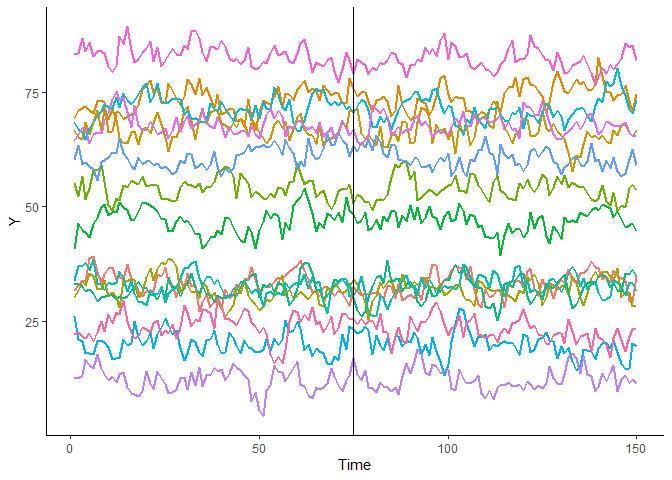
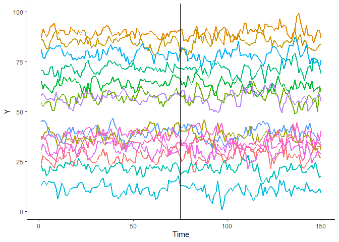
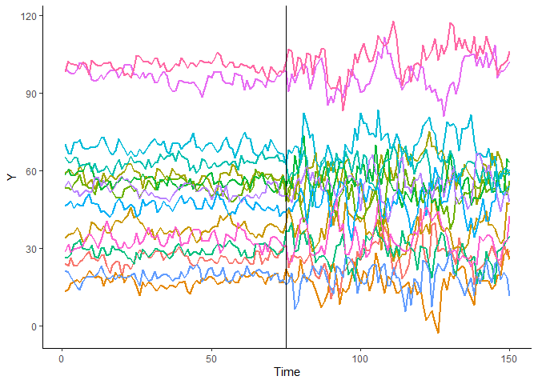
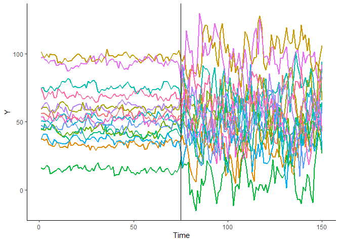

## Introduction

This document provides the R functions used in performing the proposed
test for changes in error variance in multiple time series. The first
part shows the data generating process of the multiple time series
incorporating possible system changes in the error variance at a known
break point or change point. Plots of some of the generated data sets
are provided.

The second part shows the R function for the estimation procedure used
in estimating the postulated model before and after the change point.
The estimates obtained from this procedure is used to regenerate data
sets having the same behavior as the original multiple time series in an
attempt to construct the empirical distribution of the the test
statistic through bootstrap. The R function used in regenerating the
time series is presented in Section 3 of this document.

The last part shows the R function for the proposed test for change in
error variance using the estimation procedure and data generating
process describe in the previous sections. This is followed by
applications of the proposed test to the simulated data sets to
illustrate the test’s ability to detect presence or absence of change in
error variance of multiple time series.

## Simulated Multiple Time Series Data

The following R function is used to simulate a time series with length
*L*, change point at point *brkpt*, autoregressive parameter *rho*,
error variance before and after the change point, *epsd*, and the
coefficient of variation *cv* of the random effects. This function is
used to generate the *N* time series following similar behavior as
described by the common autoregressive parameter but exhibiting
independence by having random effects.

``` r
# This function generates the kth time series, with specified parameters:

# k     = kth of the N time series
# L     = length of time series
# brkpt = break/change point
# rho   = autoregressive parameter
# epsd  = vector of standard deviation of the error terms with length 2
# cv    = coefficient of variation of the random effects

gendata <- function(k,L,brkpt,rho,epsd,cv){
  
  # Create the data frames for a time series before and during the change point
  ts1 <- NULL
  ts2 <- NULL
  
  # Initial values for the series [y - current value; yl - previous value]
  y <- 0
  yl <- 0
  
  # Random effect for individual i
  rmean <- runif(1,10,100)
  rsd <- rmean*cv
  lambda <- rnorm(1, rmean, rsd)
  
  for(n in -500:(brkpt-1)){
    # Simulate an AR(1) data before the change point
    eps<-rnorm(1,0,epsd[1])
    ytf<-rho*y+eps
    
    # Add the random effect for individual i
    ylt <- ytf + lambda
    
    # Data frame
    ts<-data.frame(indv=k, time=n, yt=ylt, yt_1=yl)
    ts1<- rbind(ts1, ts)
    
    # store values
    y<-ytf
    yl <- ylt
  }
  
  for(n in brkpt:L){
    # Simulate an AR(1) data during the change point
    eps<-rnorm(1,0,epsd[2])
    ytf<-rho*y+eps
    
    # Add the random effect for individual i
    ylt <- ytf + lambda
    
    # Data frame
    ts<-data.frame(indv=k, time=n, yt=ylt, yt_1=yl)
    ts2<- rbind(ts2, ts)
    
    # store values
    y<-ytf
    yl <- ylt
  }
  
  # Combine series before and during the change point
  series <- rbind(ts1,ts2)
  
  # Delete the first 500 observations in the series
  series <- subset(series,time>0)
  series$indv <- as.factor(series$indv)
  
  return(series)
}
```

To illustrate the use of the proposed test for change in error variance,
four data sets are generated using the above **gendata** function with
varying changes in the error variance before and after a change point.

Multiple Time Series 1: No change in error variance

``` r
# Set the random number generator
set.seed(1)

# Simulate Data
y1<-do.call(rbind,lapply(1:15,gendata,L=150,brkpt=75,rho=0.6,epsd=c(2,2),cv=0.05))

# First 10 observations
head(y1,10)
```

    ##     indv time       yt     yt_1
    ## 502    1    1 31.80249 36.64632
    ## 503    1    2 32.81467 31.80249
    ## 504    1    3 33.82066 32.81467
    ## 505    1    4 33.68800 33.82066
    ## 506    1    5 38.67050 33.68800
    ## 507    1    6 39.05371 38.67050
    ## 508    1    7 35.70030 39.05371
    ## 509    1    8 33.50688 35.70030
    ## 510    1    9 35.26898 33.50688
    ## 511    1   10 36.51294 35.26898

``` r
# Plot of MT Series 1
library(ggplot2)

ggplot(y1, aes(x=time, y=yt, group=indv, colour=indv))+geom_line(size=0.75)+
  theme(panel.grid.major=element_blank(),panel.grid.minor=element_blank(),
       panel.background=element_blank(),axis.line=element_line(colour="black"))+
  labs(x="Time",y="Y",colour="Series")+
  theme(legend.background=element_rect(color=NA))+geom_line(show.legend=FALSE)+
  geom_vline(xintercept=75)+theme(legend.position = "none")
```

<!-- -->

Multiple Time Series 2: with small change in error variance

``` r
# Set the random number generator
set.seed(2)

# Simulate Data
y2<-do.call(rbind,lapply(1:15,gendata,L=150,brkpt=75,rho=0.6,epsd=c(2,2.5),cv=0.05))

# First 10 observations
head(y2,10)
```

    ##     indv time       yt     yt_1
    ## 502    1    1 23.91849 25.45062
    ## 503    1    2 28.12457 23.91849
    ## 504    1    3 27.04735 28.12457
    ## 505    1    4 25.97196 27.04735
    ## 506    1    5 25.48033 25.97196
    ## 507    1    6 24.32552 25.48033
    ## 508    1    7 23.42038 24.32552
    ## 509    1    8 21.75282 23.42038
    ## 510    1    9 25.60456 21.75282
    ## 511    1   10 24.99905 25.60456

``` r
# Plot of MT Series 1
library(ggplot2)

ggplot(y2, aes(x=time, y=yt, group=indv, colour=indv))+geom_line(size=0.75)+
  theme(panel.grid.major=element_blank(),panel.grid.minor=element_blank(),
       panel.background=element_blank(),axis.line=element_line(colour="black"))+
  labs(x="Time",y="Y",colour="Series")+
  theme(legend.background=element_rect(color=NA))+geom_line(show.legend=FALSE)+
  geom_vline(xintercept=75)+theme(legend.position = "none")
```

<!-- -->

Multiple Time Series 3: With moderate change in error variance

``` r
# Set the random number generator
set.seed(3)

# Simulate Data
y3<-do.call(rbind,lapply(1:15,gendata,L=150,brkpt=75,rho=0.6,epsd=c(2,5),cv=0.05))

# First 10 observations
head(y3,10)
```

    ##     indv time       yt     yt_1
    ## 502    1    1 24.22920 24.21176
    ## 503    1    2 23.14258 24.22920
    ## 504    1    3 26.24892 23.14258
    ## 505    1    4 23.35423 26.24892
    ## 506    1    5 23.36230 23.35423
    ## 507    1    6 24.96977 23.36230
    ## 508    1    7 25.74511 24.96977
    ## 509    1    8 27.76563 25.74511
    ## 510    1    9 28.80800 27.76563
    ## 511    1   10 26.01617 28.80800

``` r
# Plot of MT Series 1
library(ggplot2)

ggplot(y3, aes(x=time, y=yt, group=indv, colour=indv))+geom_line(size=0.75)+
  theme(panel.grid.major=element_blank(),panel.grid.minor=element_blank(),
       panel.background=element_blank(),axis.line=element_line(colour="black"))+
  labs(x="Time",y="Y",colour="Series")+
  theme(legend.background=element_rect(color=NA))+geom_line(show.legend=FALSE)+
  geom_vline(xintercept=75)+theme(legend.position = "none")
```

<!-- -->

Multiple Time Series 4: With large change in error variance

``` r
# Set the random number generator
set.seed(4)

# Simulate Data
y4<-do.call(rbind,lapply(1:15,gendata,L=150,brkpt=75,rho=0.6,epsd=c(2,10),cv=0.05))

# First 10 observations
head(y4,10)
```

    ##     indv time       yt     yt_1
    ## 502    1    1 56.02200 51.89342
    ## 503    1    2 56.24571 56.02200
    ## 504    1    3 56.01263 56.24571
    ## 505    1    4 54.70861 56.01263
    ## 506    1    5 53.43167 54.70861
    ## 507    1    6 57.35528 53.43167
    ## 508    1    7 57.12450 57.35528
    ## 509    1    8 51.85412 57.12450
    ## 510    1    9 53.61632 51.85412
    ## 511    1   10 55.05194 53.61632

``` r
# Plot of MT Series 1
library(ggplot2)

ggplot(y4, aes(x=time, y=yt, group=indv, colour=indv))+geom_line(size=0.75)+
  theme(panel.grid.major=element_blank(),panel.grid.minor=element_blank(),
       panel.background=element_blank(),axis.line=element_line(colour="black"))+
  labs(x="Time",y="Y",colour="Series")+
  theme(legend.background=element_rect(color=NA))+geom_line(show.legend=FALSE)+
  geom_vline(xintercept=75)+theme(legend.position = "none")
```

<!-- -->

## Estimation Procedure

The proposed test uses the estimation procedure proposed by Veron Cruz
and Barrios (2014) to estimate the common autoregressive parameter, the
random effects, and the error variance before and after the change
point. The following R function performs the proposed estimation
procedure.

``` r
# This function estimates the diferent parameters of the proposed model before and after the change point

# data     = data frame that includes all Y(t)s in a column and all Y(t-1)s in another column
# N        = number of time series in the data
# L        = length of each series
# brkpt    = known break/changepoint
# max_iter = number of maximum allowable iteration before force stopping the algorithm 
# cut      = convergence criterion (absolute percent change)

estimate <- function(data,brkpt,max_iter,cut){
  
  # Obtain unique series IDs for iteration
  series.id <- unique(data$indv)
  
  # Set initial set-up for convergence
  conv <- FALSE
  a <- 0
  
  # Estimation proper
  while(!conv  && a < max_iter){
    a <- a + 1
    if(a == 1){
      
      # Step 1 : Estimate random effects per time series
      rand_effects <- lme(yt~1,random=~1|indv,control=lmeControl(opt='optim'), method="REML", data=data)
      
      # Save estimated random effects
      reff_p <- as.numeric(unlist(coef(rand_effects)))
      
      # Step 2 : Define residual resid1
      data$reff <- as.numeric(fitted(rand_effects))
      data$resid1 <- data$yt - data$reff
      
      # Step 3 : Estimate autoregressive parameter rho thru modified forward search algorithm
      ar_comp <- NULL
      
      for(n in 1:length(series.id)){
        sub <- subset(data,indv==series.id[n])
        
        ar_n1 <- NULL
        
        if(is.error(try(arima(sub$resid1,order=c(1,0,0)),silent=TRUE))==TRUE){
          ar_n1 <- 1
        } else{
          ar_mod <- arima(sub$resid1,order=c(1,0,0))
          ar_n1 <- as.numeric(coef(ar_mod)[1])
        }
        
        ar_comp <- c(ar_comp,ar_n1)
      }
      
      # Obtain bootstrap resample mean for rho
      ar_bs_comp <- NULL
      
      for(c in 1:200){
        samp_ind <- sample(length(ar_comp),length(ar_comp),replace=TRUE)
        ar_samp <- ar_comp[samp_ind]
        ar_bs_comp <- c(ar_bs_comp,mean(ar_samp,na.rm=TRUE))
      }
      
      # Save the estimated bootstrap mean
      ar_p <- mean(ar_bs_comp,na.rm=TRUE)
      
      # Step 4 : Define new residual resid2
      data$resid2 <- data$yt - ar_p*data$yt_1
      
    } else{
      
      # Step 5 : Estimate random effects per time series
      rand_effects <- lme(resid2~1,random=~1|indv,control=lmeControl(opt='optim'), method="REML",data=data)
      
      # Save estimated random effects
      reff_n <- as.numeric(unlist(coef(rand_effects)))
      
      # Step 6 : Define residual resid1
      data$reff <- as.numeric(fitted(rand_effects))
      data$resid1 <- data$yt - data$reff
      
      # Step 7 : Estimate autoregressive parameter rho thru modified forward search algorithm
      ar_comp <- NULL
      
      for(n in 1:length(series.id)){
        sub <- subset(data,indv==series.id[n])
        
        ar_n1 <- NULL
        
        if(is.error(try(arima(sub$resid1,order=c(1,0,0)),silent=TRUE))==TRUE){
          ar_n1 <- 1
        } else{
          ar_mod <- arima(sub$resid1,order=c(1,0,0))
          ar_n1 <- as.numeric(coef(ar_mod)[1])
        }
        ar_comp <- c(ar_comp,ar_n1)
      }
      
      # Obtain bootstrap resample mean for rho
      ar_bs_comp <- NULL
      for(c in 1:200){
        samp_ind <- sample(length(ar_comp),length(ar_comp),replace=TRUE)
        ar_samp <- ar_comp[samp_ind]
        ar_bs_comp <- c(ar_bs_comp,mean(ar_samp,na.rm=TRUE))
      }
      
      # Save the estimated bootstrap mean
      ar_n <- mean(ar_bs_comp,na.rm=TRUE)
      
      # Step 8 : Define new residual resid2
      data$resid2 <- data$yt - ar_n*data$yt_1
      
      # Check for convergence of the estimation procedure
      check_p <- abs((ar_n - ar_p)/ar_p)
      
      # When at least one random effect mean is estimated to be zero, set convergence for the random effects to be TRUE
      
      if(!0 %in% reff_p){
        check_reff <- mean(abs((reff_n - reff_p)/reff_p))
      }else{
        check_reff <- 0        
      }
      if(check_p < cut && check_reff < cut){
        conv = TRUE
      }
      
      # Setting each estimate as previous estimates for the next iteration
      ar_p <- ar_n
      reff_p <- reff_n
    }
  }
  # Variance of lambdas
  lambsd <- as.numeric(VarCorr(rand_effects)[1,1])
  
  # Compute for the fitted values
  data$fitted <- ar_n*data$yt + data$reff
  
  # Final residuals
  data$residual <- data$yt - data$fitted
  
  # Compute the mean residual per series
  group_mean <- mean(data$residual, na.rm=TRUE)
  
  # Compute for the adjusted residuals
  data$gresid <- data$residual - group_mean
  
  # Squared residuals for MSE
  data$residual_sq <- data$gresid^2
  
  # Overall MSE before and after breakpoint
  mse_bef <- mean(data$residual_sq[data$time<brkpt], na.rm=TRUE)
  mse_aft <- mean(data$residual_sq[data$time>=brkpt], na.rm=TRUE)
  
  # Return a list of values
  return(list(ar=ar_n,reff=reff_n,lsd=lambsd,mse_bef=mse_bef,mse_aft=mse_aft,num_iter=a))
}
```

## Bootstrap Method

The proposed test uses a bootstrap procedure using the method of sieves
where the estimated parameters from the proposed model will be used to
generate the empirical distribution of the proposed test statistic,
i.e. ratio of the MSE before and after the change point. The following R
function performs the data regeneration procedure used in the bootstrap
method in the proposed test.

``` r
# This function generates the kth time series to be used in AR Sieve Bootstrap

# k       = kth time series
# L.s     = length of time series
# brkpt.s = break/change point
# rho.s   = estimated autoregressive parameter
# rmean.s = estimated random effects
# epsd.s  = estimated vector of standard deviation of the error terms with length 2

sieve_data <- function(k,L.s,brkpt.s,rho.s,rmean.s,lsd.s,epsd.s){
  
  # Create the data frame for a time series before and after the change point
  ts1 <- NULL
  ts2 <- NULL
  
  # Initial values for the series
  y <- 0
  yl <- 0
  
  # Bounds for the AR Sieve error component
  uppr <- sqrt(3*epsd.s)
  lwr <- (-uppr)
  
  # Bounds for lambdas
  upp_lambda <- rmean.s[k] + sqrt(3*lsd.s)
  low_lambda <- rmean.s[k] - sqrt(3*lsd.s)
  
  # Random effects for individual k
  lambda <- runif(1, low_lambda, upp_lambda)
  
  for(n in -500:(brkpt.s-1)){
    
    # Simulate the dgp of an AR(1) model before the changepoint
    eps <- runif(1,lwr[1],uppr[1])
    ytf <- rho.s*y+eps
    
    # Add random effects for individual k
    ylt <- ytf + lambda
    
    # Data frame
    ts<-data.frame(indv=k, time=n, yt=ylt, yt_1=yl, eps=eps, lambda=lambda)
    ts1<- rbind(ts1, ts)
    
    # store values
    y<-ytf
    yl <- ylt
  }
  
  for(n in brkpt.s:L.s){
    
    # Simulate the dgp of an AR(1) model during the changepoint
    eps <- runif(1,lwr[2],uppr[2])
    ytf <- rho.s*y+eps
    
    # Add random effects for individual k
    ylt <- ytf + lambda
    
    # Data frame
    ts<-data.frame(indv=k, time=n, yt=ylt, yt_1=yl, eps=eps, lambda=lambda)
    ts2<- rbind(ts2, ts)
    
    # store values
    y<-ytf
    yl <- ylt
  }
  
  # Combine the two series before and during changepoint
  series <- rbind(ts1,ts2)
  
  # Delete the first 500 observations in the series
  series <- subset(series,time>0)
  series$indv <- as.factor(series$indv)
  
  return(series)
}
```

## Test for Change in Error Variance

The proposed test for change in error variance of multiple time series
includes estimating the parameters of the multiple time series model
before and after the known change point and use these estimates to
regenerate the data repeatedly through the sieve bootstrap. From these
regenerated multiple time series, the model parameters are again
estimated obtaining values for the MSE before and after the change
point. These values constitute the empirical distribution of the
proposed test statistic. The following R function performs the proposed
test given a multiple time series data with a known change point.

``` r
# This function performs the proposed test for change in error variance given a multiple time series data and a known possible change point.

# yn      = data frame that includes all Y(t)s in a column and all Y(t-1)s in another column
# N       = number of time series in the data
# L       = length of each series
# brkpt   = known break/changepoint
# j       = seed number

ErrorVarTest <- function(yn,N,L,brkpt,j){
  
  # Estimate the model
  est_model <- estimate(yn,brkpt=brkpt,max_iter=1000,cut=0.001)
  
  # Estimated model parameters for the sieve bootstrap
  rho.s   <- est_model$ar
  rmean.s <- est_model$reff
  epsd.s  <- c(est_model$mse_bef,est_model$mse_aft)
  lsd.s <- est_model$lsd
  
  # Set up parallel computing parameters
  no_cores <- detectCores()
  no_cores
  cl <- makeCluster(no_cores-1)
  registerDoParallel(cl)
  getDoParWorkers()
  
  # Replicate the current scenario (v-u) times in parallel
  ratio_data <- foreach(m=1:200,.combine='rbind', .export=c('estimate','sieve_data'),  .packages=c('nlme','assertthat')) %dopar% {
    
    # Set the random number generator
    seed_no <- ((3^7)*j+m)
    set.seed(seed_no, kind="L'Ecuyer-CMRG")
    
    # Regenerate the N time series
    sdata <- do.call(rbind,lapply(1:N,sieve_data,L,brkpt,rho.s,rmean.s,lsd.s,epsd.s))
    
    ## Re-estimate the model
    sievetrial <- estimate(sdata,brkpt=brkpt,max_iter=1000,cut=0.001)
    
    # Compute for the Ratio Statistic
    comp_ratio <- sievetrial$mse_bef / sievetrial$mse_aft
    
    return(comp_ratio)
  }
  
  stopCluster(cl)
  
  # Determine the 95% bootstrap confidence interval
  p2.5 <- quantile(ratio_data,prob=0.025,na.rm=TRUE)
  p97.5 <- quantile(ratio_data,prob=0.975,na.rm=TRUE)
  
  # Determine if the confidence interval contains 1 
  if(p2.5<1 && p97.5>1){
    tag <- "Do not reject Ho"
  } else{
    tag <- "Reject Ho"
  }
  
  # Test Statistic
  MSE_Ratio  <- round(est_model$mse_bef/est_model$mse_aft,3)
  
  # Output
  TestResult <- data.frame(value=as.numeric(MSE_Ratio),lcl=as.numeric(p2.5),ucl=as.numeric(p97.5),Result=tag)
  
  return(list(TestResult))

}
```

The following R packages are needed for the above R functions to work.

``` r
library(nlme)
library(assertthat)
library(doParallel)
```

## Examples

Using the four simulated multiple time series data sets, we perform the
proposed test for change in error variance as follows.

**Multiple Time Series 1: No change in error variance**

``` r
ErrorVarTest(y1,N=15,L=150,brkpt=75,j=123)
```

    ## [[1]]
    ##   value       lcl     ucl           Result
    ## 1 1.032 0.9061005 1.17376 Do not reject Ho

From the above test result, the value 1 is contained in the 95%
confidence interval which means that we failed to reject the null
hypothesis of no change in error variance. Thus, the proposed test
correctly determined the absence of change in error variance before and
after the change point at time 75.

**Multiple Time Series 2: with small change in error variance**

``` r
ErrorVarTest(y2,N=15,L=150,brkpt=75,j=124)
```

    ## [[1]]
    ##   value       lcl       ucl    Result
    ## 1 0.604 0.5309775 0.6990575 Reject Ho

We have enough evidence to reject the null hypothesis and conclude that
there is a change in error variance of the multiple time series before
and after the change point at time 75. Even for a small change in the
error variance used in the simulation of the above data, the proposed
test correctly detected the presence of this change.

**Multiple Time Series 3: With moderate change in error variance**

``` r
ErrorVarTest(y3,N=15,L=150,brkpt=75,j=125)
```

    ## [[1]]
    ##   value       lcl       ucl    Result
    ## 1 0.176 0.1644099 0.2222834 Reject Ho

In the presence of moderate change in error variance, the proposed test
also correctly detected this change leading to the rejection of the null
hypothesis.

**Multiple Time Series 4: With large change in error variance**

``` r
ErrorVarTest(y4,N=15,L=150,brkpt=75,j=126)
```

    ## [[1]]
    ##   value        lcl        ucl    Result
    ## 1  0.06 0.06255669 0.08869011 Reject Ho

Lastly, the proposed test also detected the presence of a change in
error variance in the last data set. Notice that the test statistic
values and their associated 95% confidence intervals are further away
from the value 1 as the amount of change in error variance before and
after the change point increases. Thus, the magnitude of the change in
error variance can be deduced from the test statistic and its 95%
confidence interval.

<a rel="license" href="http://creativecommons.org/licenses/by/4.0/"></a><br />This
work is licensed under a
<a rel="license" href="http://creativecommons.org/licenses/by/4.0/">Creative
Commons Attribution 4.0 International License</a>.
